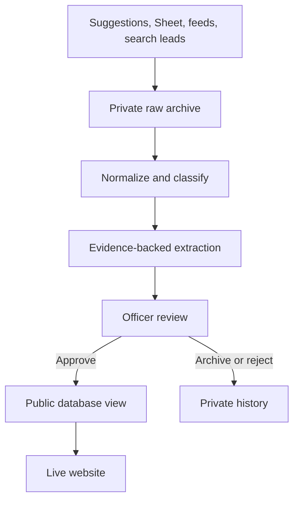

# Operational pipeline and rollout

Status: implemented but disabled pending preview-database validation, September 10, 2026

## The short answer

The database, not GitHub or the officer Sheet, is the publication boundary.

1. A suggestion, Sheet row, official feed item, public page, or search result enters private intake.
2. The original input is archived before normalization.
3. Deterministic code classifies the record. A low score changes routing, never retention.
4. An optional model extracts fields and exact source quotes into `pipeline_extractions`.
5. An officer reviews and edits the private draft at `/admin/review`.
6. `decide_opportunity_review` is the only automated-ingestion path that may approve it.
7. `public_opportunities` exposes only approved and public-safe graduate records.
8. `/internships` reads that view on each request, so approval updates the website without a new Vercel deployment.



## What is implemented

| Stage | Implementation | Current state |
| --- | --- | --- |
| Public suggestions | `user_submissions` and `/admin/review?tab=submissions` | Working |
| Spreadsheet intake | One-click read-only Sheet sync or CSV upload at `/admin/import`; original rows saved in `raw_import_rows` | Implemented, officer-triggered |
| Official Greenhouse feed | `scripts/run-ingestion-worker.ts` and the tested Greenhouse connector | Implemented, not scheduled |
| Public program pages | Conditional fetch with optional Scrapling and ScrapeGraphAI fallback | Implemented, not scheduled |
| Raw archive | Private `source-payloads` storage plus `source_payloads` metadata and hashes | Implemented |
| Search lead archive | Private `discovery_leads` plus immutable observations | Implemented in migration 0013, not applied |
| Posting history | `source_postings` plus immutable `source_posting_versions` | Implemented |
| Classification | Versioned graduate taxonomy in `taxonomy/lanes.yaml` | Implemented |
| Extraction | `scripts/run-extraction-worker.ts`, local OmniRoute adapter, quote binding, transit sentinel | Implemented, model disabled by default |
| Officer decision | `/admin/review` plus atomic `decide_opportunity_review` | Working after migration 0011 |
| Public board | `public_opportunities` read by the dynamic `/internships` route | Working after migration 0011 |
| Source scheduling | Queue claim exists; no recurring job is enabled | Deliberately disabled |
| Direct Google Sheet sync | Fixed file/range, read-only service account, existing CSV import path | Implemented, not configured |
| Integration status | `/admin/integrations` reports each durable handoff | Implemented |

## Receive and archive rules

Every discovery must end in one of these recorded states:

| Input | Raw record | Normalized record | Public effect |
| --- | --- | --- | --- |
| Public form | `user_submissions` | Officer-created draft | None until approval |
| Google Sheet or Excel CSV | `raw_import_rows` | Draft opportunity or change task | None until approval |
| Official feed | `source_payloads` | `source_postings` and version history | None until approval |
| Program page | `source_payloads` | One versioned page observation | None until approval |
| LinkedIn or web lead | `discovery_leads` plus immutable `discovery_lead_observations` | Official source record when found | LinkedIn alone is not publication evidence |
| Low relevance, adjacent, special, or ineligible | Same raw and normalized history | Archive reason and classification | Hidden from the graduate board, never erased |

“Not on the graduate board” does not mean “deleted.” It means the record remains available for audits, future undergrad work, source evaluation, and taxonomy improvements.

## LinkedIn discovery

LinkedIn is valuable as a lead surface because employers and staff often announce roles there before search engines fully index an ATS. It is also a poor canonical source because availability, access, and descriptions can change by session.

The system therefore uses this sequence:

1. A public web search or officer submission captures the LinkedIn URL, visible snippet, query, and retrieval time.
2. A resolver searches for the employer-owned careers or ATS URL.
3. If found, that official URL becomes the source checked by extraction and officers. The LinkedIn URL remains attached as provenance.
4. If not found, the lead remains `linkedin_only` or `unresolved`. It may be shown to officers, but cannot establish dates, eligibility, or open status for the public board.

The automated worker does not log into LinkedIn, reuse session cookies, solve challenges, rotate accounts, or evade quotas. Officers can still submit a valuable LinkedIn lead manually, and the system will preserve it.

## Scraping and model tools

### Scrapling

`scripts/tools/scrapling-fetch.py` renders one terms-reviewed public URL. The TypeScript wrapper performs SSRF checks, launches a fixed executable with fixed arguments, passes no credentials or proxy environment, limits runtime, and caps output at 10 MiB. Browser installation is separate because it is large.

### ScrapeGraphAI

The hosted fallback calls only the scrape endpoint and requests Markdown. It explicitly disables stealth and sends no cookies, proxy settings, or extraction schema. Its returned text is archived before local extraction. A monthly budget guard limits use.

### OmniRoute

The extraction adapter defaults to `http://127.0.0.1:20128/v1`. Remote gateways require an explicit flag. Every extraction request sends `X-OmniRoute-Compression: off` because prompt compression would break exact quote binding. The worker contains no approval operation.

### Graphify

Graphify is development-only. It indexes the repository to help maintainers trace dependencies and impact. It has no database credential, runtime role, or publication authority.

## Spreadsheet workflow

The current safe path is:

1. Officers maintain the Google Sheet or Excel workbook.
2. At `/admin/import`, click `Sync from Google Sheet`. For Excel or a Google outage, upload a CSV and select the source.
3. The import archives every original row, normalizes it, detects duplicates, and creates private drafts or change tasks.
4. Officers check `/admin/integrations` for the recorded run and any failures.
5. Officers complete `/admin/review`.
6. Approval immediately changes what the dynamic public board reads.

The Sheet connection uses a club-owned service account with the `spreadsheets.readonly` OAuth scope and Viewer access to one file. The file ID, bounded tab range, and `source_records` UUID are fixed in server-only configuration. Sheet columns that look like approval controls are intentionally ignored. Sheet edits cannot set `public_safe`, `review_status`, or public status.

## Search coverage

The canonical terms live in `src/lib/pipeline/taxonomy/lanes.yaml`. `search-plan.ts` turns every lane into five query families:

1. an official-feed query;
2. a broad web query with graduate and cycle terms;
3. a public ATS-domain query;
4. a LinkedIn jobs lead query;
5. a LinkedIn posts lead query.

Tests assert that all ten lanes receive official ATS and LinkedIn query families. The opportunity and eligibility vocabulary is intentionally separate from scientific-lane terms, so a posting can omit “genomics” yet still match methods such as variant curation or RNA-seq.

Lane search is only one pass. A separate employer-inventory plan searches every known employer for broad internship, co-op, technology, data, R&D, career-program, and student-program language without requiring a scientific term. This is the pass that captures generic titles such as J&J's “Technology 2027 Co-Op.” Every returned result is archived first and classified second.

## Recurring agent design

Use separate bounded jobs with distinct write permissions:

| Job | Cadence in recruiting season | Writes |
| --- | --- | --- |
| Feed monitor | Daily | Fetch runs, payloads, posting versions |
| Program-page monitor | Two or three times weekly | Fetch runs, payloads, one page observation |
| Lane scout | Three times weekly, one lane per run | Private leads and resolution status |
| Employer inventory | Weekly in season, one employer batch per run | All observed student-program leads |
| Eligibility extractor | After new or material versions | `pipeline_extractions` only |
| Source-health monitor | Daily, digest weekly | Health fields and alerts |
| Officer digest | Monday | Email only |

Each run must record a stable run ID, query or source ID, taxonomy version, retrieved time, original URL, canonical URL when found, outcome, and error. Use idempotency keys so retries do not duplicate records.

Recommended activation sequence:

1. Apply migrations through 0013 to a preview Supabase project.
2. Seed one disabled Greenhouse source and one disabled public program page.
3. Run the ingestion worker manually and inspect the private payload, posting, version, draft, and task.
4. Run extraction on at least 30 real officer-labelled postings. Keep learned ranking disabled until the evaluation gate passes.
5. Test approve, archive, reject, and changed-approved behavior with officer and anonymous clients.
6. Enable one source at low frequency.
7. Add a scheduler only after two clean weeks and a source-health alert.
8. Configure direct Sheet sync only after the app review queue has become the officers' normal workspace; run a preview sync before production.

## Improvements still needed

1. Add production connectors for Ashby, Lever, and USAJOBS to the canonical persistence runner. Pure parsers exist, but live connector calls have not been verified.
2. Connect a search provider to the private lead archive before recurring lane scouts are enabled. The archive and resolution model exist, but no scheduled provider calls them yet.
3. Preview-test the one-way Google Sheet import against the current officer workbook and document the service-account owner and rotation process. Do not build two-way field sync.
4. Increase the real golden set from 3 to at least 30 labelled postings across all lanes and edge cases.
5. Benchmark hybrid retrieval on the real corpus before applying any pgvector proposal.
6. Add metrics for missed roles, officer corrections, unresolved LinkedIn leads, source staleness, and time from discovery to publication.
7. Install a browser binary in the worker image before enabling Scrapling. The package is installed locally, but the browser download must be part of deployment provisioning.

## Commands

```bash
npm run tools:install
npm run tools:install -- --browser
npm run tools:check
npm run graphify:build
npm run omniroute:start
npm run ingest:worker
PIPELINE_MODEL_ENABLED=true PIPELINE_MODEL_NAME=auto npm run extract:worker
```

The ingestion and extraction commands require service-role database credentials. They should run only in a private worker environment. They are not browser commands and are not enabled by installing the packages.
