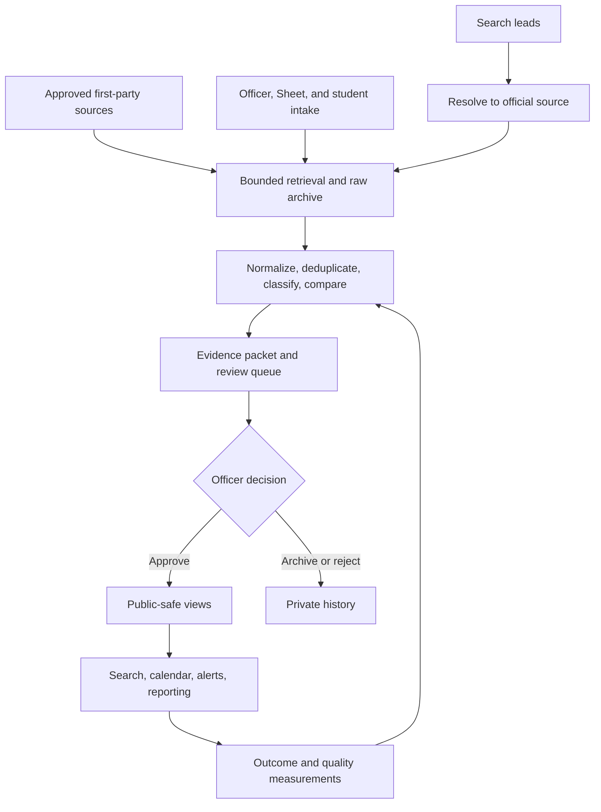

# Career Hub capability roadmap

**Planning baseline:** September 16, 2026  
**Status source:** [16-current-system-status.md](16-current-system-status.md)  
**Planning horizon:** Immediate hardening through two academic cycles

## 1. Objective

Expand the Career Hub from a working opportunity board into a durable student career infrastructure system without weakening its strongest property: no automated process can publish an unsupported claim.

The expansion must improve five outcomes:

1. **Coverage:** find more relevant biotechnology opportunities before students miss them.
2. **Accuracy:** preserve first-party evidence, state uncertainty, and avoid stale or duplicate records.
3. **Speed:** reduce time from source observation to officer-approved publication.
4. **Usability:** help undergraduate and graduate students identify roles they can actually pursue.
5. **Continuity:** make the system operable after its current developer or officers leave.

Feature count is not a success metric. A capability should ship only when its operating owner, evidence boundary, failure mode, and measurable benefit are defined.

## 2. Non-negotiable constraints

1. Automation may retrieve, archive, normalize, classify, compare, and recommend. It may not approve or publish.
2. Public pages read only restricted public views or narrowly scoped public functions.
3. First-party employer or recognized ATS evidence is preferred over aggregators and social posts.
4. LinkedIn remains a discovery lead unless written permission or an authorized retrieval interface is obtained.
5. Unsupported facts remain `Unknown`.
6. Approved public records are immutable to imports and source refreshes unless an officer performs an audited correction.
7. Private notes, submitter contact data, raw payloads, and model output do not enter public responses.
8. New sources start disabled and require terms, robots, ownership, and private-test review.
9. Student accounts are not required for core discovery. A browser-local option is preferred until an account-dependent benefit is proven.
10. Models and learned ranking remain advisory until evaluated on a real, officer-labelled corpus.

## 3. Target operating model

The public board is one consumer of a broader evidence system. Review quality, source health, and student utility must be measured separately.

## 4. Decision framework

Every proposed capability receives four scores from 1 to 5:

- **Student impact:** expected improvement in relevant opportunity access.
- **Risk reduction:** security, continuity, privacy, or accuracy benefit.
- **Evidence strength:** confidence that the need is real and the approach will work.
- **Effort:** engineering plus recurring officer burden, where 5 is highest effort.

Use this priority index:

`priority = (student impact + risk reduction + evidence strength) / effort`

The index is a comparison aid, not an automatic decision. A security blocker or legal restriction overrides the numeric result. Estimates must be revised after implementation evidence appears.

## 5. Program sequence

| Phase | Time window | Purpose | Exit gate |
| --- | --- | --- | --- |
| 0. Control | Days 0 to 14 | Establish ownership, truthful status, and security baseline | No unexplained critical ownership or security blocker |
| 1. Reliability | Days 15 to 45 | Make scheduling, review, duplicate handling, and imports observable and atomic | One complete cycle is traceable from trigger to public result |
| 2. Coverage | Days 30 to 90 | Add first-party source classes with measured recall | Each connector has a live private corpus and failure playbook |
| 3. Student utility | Days 60 to 120 | Improve discovery, comparison, calendar, and local alerts | Usability tests show faster relevant-role discovery |
| 4. Intelligence | Months 4 to 8 | Add evaluated extraction, ranking, and quality metrics | Real labelled evaluation meets predefined thresholds |
| 5. Institutionalization | Months 6 to 12 | Add semester reporting, content systems, and succession controls | A new officer can operate and recover the system independently |

Phases overlap only when dependencies allow. Coverage expansion must not outrun review capacity.

## 6. Phase 0: control and governance

### C0.1 Organizational ownership

**Problem:** GitHub is personally owned, Vercel ownership is not independently verified, and only one active officer exists.

**Work:**

- Transfer or share the repository through a club-controlled GitHub organization.
- Confirm the exact Vercel project, production domain, Git integration, cron entries, and billing owner.
- Record the Supabase organization owner, project owner, recovery method, billing owner, backup owner, and password-manager location.
- Maintain at least two active officers and one advisor with tested access.
- Create an access-removal procedure for graduating officers.

**Acceptance:** two officers and one advisor can independently reach the documented systems; one officer completes a recovery drill without the original developer.

### C0.2 Database security remediation

**Problem:** current Supabase advisors report security-definer view errors and related warnings.

**Work:**

- Convert public views to `security_invoker` where the public access model permits it, or move privileged logic into narrowly granted functions.
- Review `is_officer` ownership, fixed `search_path`, explicit execute grants, and in-function identity checks.
- Move `pg_trgm` out of the public schema if migration risk is acceptable.
- Enable leaked-password protection.
- Document the service-only rate-limit table and confirm browser roles have no direct access.
- Add advisor output to the release checklist.
- For every new Data API object, use explicit grants. Supabase is moving to non-exposure of new public-schema tables by default, with broader enforcement scheduled for October 30, 2026.

**Acceptance:** no unexplained error-level advisor finding; every exception has a threat model, owner, and regression test.

### C0.3 Credential and recovery register

**Work:** create a private register for service owners, credential purpose, storage location, rotation date, recovery method, and least-privilege scope. Do not store secret values in the repository.

**Acceptance:** a quarterly access review can be completed from the register without searching personal messages.

### C0.4 Image delivery repair

**Problem:** the visible hero and footer depend on external CSS background URLs, while the local footer file is obsolete and hidden.

**Work:**

- Download or otherwise obtain the intended reusable zebrafish asset under its license.
- Store it under an accurate name.
- Render the visible hero and footer with `next/image`.
- Remove zero-opacity semantic-image workarounds.
- Centralize asset path, source, creator, license, credit, and alt text.
- Test 390 px, 430 px, tablet, and desktop layouts with external image requests blocked.

**Acceptance:** the selected imagery and mobile footer remain correct without third-party image availability.

## 7. Phase 1: reliability and officer operations

### R1.1 Scheduler identity and service-level monitoring

Add `trigger_origin`, external invocation ID, repository revision, and deployment identifier to pipeline-cycle observability. Use distinct values for Vercel, GitHub recovery, officer action, and local test.

Add alerts for:

- no successful canonical cycle within 26 hours;
- any enabled source with three consecutive failures;
- a cycle that starts but does not finish within 20 minutes;
- an open source-health task older than two officer-review windows.

**Acceptance:** one controlled Vercel run and one recovery run are distinguishable, idempotent, and traceable to source-run records.

### R1.2 Atomic duplicate decisions

Create one database procedure that locks the survivor and duplicate records, verifies the active officer, updates lifecycle and review state together, closes related tasks, and records an immutable revision.

**Acceptance:** concurrent duplicate actions cannot create partial state; every decision is attributable and reversible.

### R1.3 Conditional retrieval correctness

Persist and reuse ETag and Last-Modified validators in the canonical static/API runner. Treat HTTP 304 as a successful unchanged observation. Reset a stale validator only after a controlled retry.

**Acceptance:** a 304 neither degrades source health nor archives a duplicate full payload; redirect and validator-reset cases have tests.

### R1.4 Import limits and failure isolation

Apply explicit CSV limits for bytes, rows, columns, field length, and route processing time. Validate before writing large batches. Preserve bounded row errors without returning an unbounded UI payload.

**Acceptance:** oversize fixtures fail predictably, normal files remain idempotent, and the server route stays within its execution budget.

### R1.5 Review queue service levels

Add task age, evidence completeness, source confidence, and assigned officer. Establish review targets:

- new verified-source candidates: 3 days;
- material changes to public records: 1 day;
- possible closure or broken link: 1 day;
- public corrections: same officer session when evidence is clear.

Assignments should improve coordination without making a task invisible to other officers.

**Acceptance:** the dashboard shows queue age and owner; the weekly digest highlights breached targets.

### R1.6 Deadline maintenance

Do not silently expire records solely because a parsed date passes. Add a bounded candidate sweep that opens a task for roles with a past deadline or repeatedly missing source evidence. Give officers bulk-confirm controls for unambiguous cases.

**Acceptance:** all past-deadline public records enter review within 24 hours while rolling deadlines remain unaffected.

### R1.7 Metric semantics

Rename `records_archived` or change its calculation so it does not mean “all normalized observations.” Define each dashboard metric in code and tests.

**Acceptance:** source, cycle, and public totals reconcile from raw rows through the dashboard.

## 8. Phase 2: source and discovery coverage

### 8.1 Connector expansion ladder

Add source coverage in this order:

1. **Greenhouse:** expand the proven connector across prioritized employers.
2. **Lever:** private-test one stable employer before broader use.
3. **Ashby:** private-test one stable employer and validate department/location structures.
4. **Government and national laboratories:** USAJOBS plus bounded official program pages.
5. **Schema.org pages:** only where structured data is complete and stable.
6. **Static pages:** only after direct-fetch and fallback reliability is proven.
7. **RSS or other API:** only after the canonical runner supports those registered kinds.

For each connector/source combination, record:

- terms and robots decision;
- official domain and ownership;
- pagination behavior;
- expected update interval;
- response and body limits;
- location and deadline semantics;
- closure behavior;
- sample true positives and false positives;
- disable and recovery procedure.

**Acceptance:** one live private corpus, three successful observations, and officer review of every generated task before enabling normal scheduling.

### 8.2 Employer priority model

Build a transparent source-priority score using only auditable factors:

- known biotechnology relevance;
- Southern California or remote accessibility;
- undergraduate/graduate fit;
- historical internship frequency;
- official source availability;
- application-cycle urgency;
- source stability and policy risk.

The score prioritizes search effort. It must not rank employers as better or worse for students.

### 8.3 Discovery recall evaluation

Build a monthly benchmark from known postings at priority employers. Measure:

- recall by source class;
- time from first official appearance to private observation;
- time from observation to publication;
- unresolved lead rate;
- false-positive rate;
- proportion of leads resolved to first-party evidence.

**Acceptance:** coverage claims use a documented denominator rather than raw posting counts.

### 8.4 LinkedIn boundary

Keep LinkedIn as a lead surface only. Do not add login automation, cookies, session reuse, CAPTCHA handling, proxy rotation, or stealth collection. Resolve public search hints or officer-submitted links to employer-controlled evidence.

**Acceptance:** no automated LinkedIn page request occurs without written permission; no public fact depends solely on a LinkedIn snippet.

### 8.5 Google Sheet operating decision

Choose one explicit Sheet mode:

- officer-triggered collaboration only; or
- bounded automatic queue mirror after each canonical cycle.

Do not describe automatic sync as active until production cycle records prove it. Add a reconciliation report for rows written, preserved, archived, skipped, and conflicted.

**Acceptance:** the chosen mode is documented, observable, and idempotent under retries.

## 9. Phase 3: student utility

### U3.1 Evidence-centered opportunity detail page

Add a stable detail route for each public opportunity. Show:

- employer and exact title;
- official source link;
- audience and stage fit;
- compensation state;
- location/work mode;
- deadline and last-checked time;
- eligibility and work-authorization evidence;
- methods, functions, and scientific lanes;
- explicit unknowns;
- report-a-correction action.

Avoid copying full employer descriptions when licensing or maintenance value is unclear. Show concise officer-written summaries and evidence excerpts within permitted limits.

**Acceptance:** a student can determine why the role is shown and what remains uncertain without reading a dense card.

### U3.2 Saved search without an account

Extend current browser-local preferences into named saved searches and optional calendar reminders. Encode only non-sensitive filters. Provide export/import so a student can move preferences between browsers without creating an account.

**Acceptance:** no server-side personal profile is created; clearing site data removes the preference state.

### U3.3 Comparison and application planning

Allow students to compare a small number of public roles by deadline, audience, compensation, location, stage, and evidence completeness. Keep application status private to the browser unless a later consented account feature is separately approved.

**Acceptance:** comparison uses only public fields and works on mobile without horizontal-page overflow.

### U3.4 Calendar quality

Add verified deadline semantics, timezone-safe exports, and a clear distinction among fixed deadline, rolling, expected window, and unknown. Historical cycle guidance must be labeled as historical rather than predicted.

**Acceptance:** `.ics`, Google Calendar, and displayed dates agree across Pacific and UTC test cases.

### U3.5 Accessibility and mobile regression suite

Add automated checks for keyboard navigation, visible focus, contrast, form errors, reduced motion, heading order, touch targets, and screen-reader names. Capture visual snapshots at 390, 430, 768, and desktop widths.

**Acceptance:** critical public flows pass automated accessibility checks and manual VoiceOver testing on iOS Safari.

### U3.6 Public trust panel

Explain the review process, last site-wide update, number of actively monitored sources, and correction pathway without overstating automation or university endorsement.

**Acceptance:** every public process claim can be traced to an observed system state.

## 10. Phase 4: evaluated intelligence

### I4.1 Real labelled corpus

Create an officer-labelled evaluation set of at least 30 postings before any learned ranker is enabled. The set must include:

- undergraduate, graduate, and mixed roles;
- relevant and adjacent science;
- manufacturing, research, computational, clinical, regulatory, and quality lanes;
- explicit and ambiguous eligibility;
- internships, co-ops, fellowships, and non-opportunities;
- duplicate cycles, changed postings, and closed roles;
- Greenhouse, Lever, Ashby, government, and static-page formats when available.

Keep an untouched test partition. Do not tune on every labelled example.

### I4.2 Extraction evaluation

Measure each field separately for precision, recall, unknown rate, quote validity, unsupported-claim rate, latency, and cost. High-risk fields such as work authorization, degree eligibility, deadline, and compensation require stricter thresholds than descriptive lanes.

Suggested release gates:

- zero unsupported public claims because model output remains private;
- at least 98 percent exact evidence binding on asserted high-risk fields;
- at least 95 percent precision on eligibility and deadline suggestions;
- measured officer time reduction without increased correction rate.

These thresholds are hypotheses and may be revised before activation, but never after seeing a poor test result merely to permit launch.

### I4.3 Learned ranking gate

Only compare a learned ranker after the deterministic baseline is measured. Use an offline evaluation and a shadow mode first. Ranking may reorder eligible public opportunities, but may not hide them or change publication state.

**Acceptance:** the learned method improves a predefined metric on the untouched test set and shows no unacceptable subgroup or lane failure.

### I4.4 Human feedback loop

Record structured reasons for officer corrections, rejection, duplicate decisions, and source-task dismissals. Use those labels for evaluation, not immediate online learning.

**Acceptance:** every model change references a versioned dataset, prompt/configuration, metrics, and rollback point.

### I4.5 Retrieval architecture restraint

Do not add pgvector, a separate vector database, Neo4j, or another retrieval service until a measured query fails with the current PostgreSQL full-text, structured filters, and deterministic graph tools. Graphify is for maintainers, not a production opportunity search dependency.

## 11. Phase 5: institutional capabilities

### N5.1 Semester impact reports

Implement reports only after the underlying definitions are agreed. Candidate measures:

- unique public opportunities observed;
- employers represented;
- undergraduate, graduate, and mixed roles;
- paid-status distribution;
- source classes and monitored-source health;
- median observation-to-publication time;
- corrections and stale removals;
- student-submitted leads accepted;
- public usage with privacy limitations clearly stated.

Do not infer applications, interviews, or placements without voluntary, consented outcome collection.

### N5.2 Resource and pathway library

The schema already contains career paths and resources. Before exposing them, define an owner, review interval, archive rule, and evidence standard. Start with a small set tied directly to the opportunity workflow: resume preparation, application timing, eligibility interpretation, and official fellowship resources.

### N5.3 Mentorship and people

Do not publish a mentor directory merely because tables exist. Require explicit opt-in consent, scope of contact, expiration/reconfirmation date, removal workflow, and public-safe fields. Separate professional information already public from club-collected contact preferences.

### N5.4 Student outcome research

If the club later studies which features help students, use a voluntary and minimal design. Define the research or service-improvement question before collecting data. Avoid collecting GPA, immigration status, disability, or detailed demographic data unless there is a compelling approved purpose and adequate governance.

## 12. Graphify development program

Graphify supports maintainability; it is not part of runtime ingestion or publication.

### Current configuration

- Package: official `graphifyy`
- Pinned version: 0.9.62
- Extraction: code-only, local tree-sitter analysis
- Community labels: deterministic placeholders, no external model
- Output: ignored `graphify-out/` directory
- Validation: multigraph diagnostic

### Required maintainer workflow

1. Install pinned tools with `npm run tools:install` or install the pinned Graphify environment.
2. Build the first graph with `npm run graphify:build`.
3. Before broad source browsing, use `npm run graphify:query -- "question"`.
4. Before modifying a highly connected component, use `npm run graphify:affected -- "symbol"`.
5. After code changes, run `npm run graphify:update`.
6. Run `npm run graphify:check` before committing structural changes.
7. Use the graph as an index, then verify important conclusions in source and tests.

### Graph quality gates

- no missing or dangling endpoints;
- no exact duplicate edges;
- queries identify expected authorization, ingestion, review, and publication paths;
- graph version matches the checked-out commit;
- generated files contain no secret values and remain uncommitted.

### Current architectural hubs

The September 16 graph identifies `requireOfficer()`, `createServiceClient()`, `IngestionRepository`, `runPipelineCycle()`, `syncReviewQueueToGoogleSheet()`, `normalizeGreenhouseJob()`, `quickAddOpportunity()`, and `classify()` among the most connected symbols. Changes to these areas require focused regression tests because their impact radius is larger than an ordinary UI component.

## 13. Observability and outcome metrics

### Pipeline health

- successful cycles per 24 hours;
- enabled sources due, claimed, completed, failed, and degraded;
- retrieval duration and bytes by connector;
- unchanged, changed, new, reopened, and missing observations;
- task creation rate and task age;
- scheduler origin and recovery use.

### Data quality

- duplicate rate by intake path;
- officer correction rate after publication;
- source URL validity;
- deadline parse confidence and later correction;
- percentage of asserted fields with evidence;
- unknown rate by field and connector;
- public record freshness.

### Coverage

- priority employers with a governed official source;
- recall against the monthly known-posting benchmark;
- median delay from official posting to observation;
- unresolved discovery leads;
- roles by audience, lane, work mode, geography, and pay state.

### Officer burden

- median review time;
- queue age and service-level breaches;
- tasks created per useful public addition;
- proportion of tasks dismissed as noise;
- weekly officer minutes required.

### Student utility

- time to find a qualifying role in moderated usability tests;
- filter and source-link success;
- calendar export completion;
- correction submissions;
- repeat public usage, interpreted within the limits of privacy-reduced analytics.

Never optimize a single count such as “jobs scraped.” High volume can indicate duplicate noise, poor relevance, or an understaffed review burden.

## 14. Prioritized backlog

| ID | Capability | Impact | Risk reduction | Evidence | Effort | Initial priority | Dependency |
| --- | --- | ---: | ---: | ---: | ---: | ---: | --- |
| C0.1 | Organizational ownership | 5 | 5 | 5 | 2 | 7.5 | Club/admin coordination |
| C0.2 | Supabase security remediation | 4 | 5 | 5 | 3 | 4.7 | Database preview and migration review |
| R1.1 | Scheduler origin and alerting | 4 | 5 | 5 | 3 | 4.7 | Verified Vercel project |
| C0.4 | Local image delivery and mobile tests | 4 | 4 | 5 | 3 | 4.3 | Licensed source asset |
| R1.2 | Atomic duplicate workflow | 3 | 5 | 5 | 3 | 4.3 | Database migration |
| R1.4 | CSV bounds | 3 | 4 | 5 | 2 | 6.0 | None |
| R1.6 | Deadline candidate review | 5 | 4 | 4 | 3 | 4.3 | Task workflow |
| 8.1 | Lever and Ashby production validation | 5 | 2 | 4 | 4 | 2.8 | Review capacity |
| U3.1 | Opportunity detail page | 5 | 2 | 4 | 3 | 3.7 | Public schema fields |
| U3.5 | Accessibility and visual regression | 5 | 4 | 5 | 3 | 4.7 | Stable design baseline |
| 8.3 | Discovery recall benchmark | 5 | 3 | 4 | 3 | 4.0 | Known-posting benchmark |
| I4.1 | Real labelled corpus | 4 | 4 | 5 | 3 | 4.3 | Officer labeling time |
| N5.1 | Semester impact reports | 4 | 2 | 3 | 4 | 2.3 | Metric definitions |
| N5.3 | Mentorship directory | 3 | 1 | 2 | 5 | 1.2 | Consent governance |

The numeric order does not override dependencies. For example, source expansion waits until review service levels and scheduler identity are working.

## 15. First 30 days

### Week 1

- Confirm organizational ownership and add a second officer plus advisor.
- Confirm the exact Vercel project and active cron entries.
- Enable leaked-password protection.
- Convert the current status and roadmap into the officer review agenda.
- Replace remote hero/footer delivery with local licensed assets.

### Week 2

- Design and review the Supabase security migration in a disposable project.
- Add scheduler-origin fields and cycle alerting design.
- Add CSV bounds.
- Define public-submission retention.
- Reconcile duplicate source records by reference analysis.

### Weeks 3 and 4

- Ship atomic duplicate decisions.
- Ship conditional-request fixes.
- Add deadline-review candidate tasks.
- Add task-age and service-level metrics.
- Run mobile accessibility and visual regression acceptance.

## 16. Days 31 to 90

1. Validate one Lever source and one Ashby source privately.
2. Expand governed Greenhouse coverage among priority employers.
3. Build the monthly discovery recall benchmark.
4. Decide and document the Google Sheet operating mode.
5. Ship evidence-centered opportunity detail pages.
6. Add saved local searches, comparison, and calendar-semantic improvements.
7. Build the first 30-record officer-labelled evaluation corpus.
8. Produce the first operational report covering source health, review delay, corrections, and freshness.

## 17. Stop conditions

Pause expansion when any of these occurs:

- the review queue exceeds its service-level target for two consecutive weeks;
- a source's legal or access permission is unclear;
- an automated path changes a public record without an officer revision;
- unsupported model suggestions reach a public field;
- source failures or stale records cannot be attributed to a specific trigger and run;
- a new feature requires sensitive student data without an approved need and retention plan;
- a connector's false-positive or duplicate burden exceeds its public benefit.

## 18. Definition of success after one academic year

The roadmap succeeds if:

1. The system is controlled by the club rather than one person.
2. At least two officers can operate and recover it.
3. Every production cycle and public decision is attributable.
4. Priority employers have broader first-party source coverage with measured recall.
5. Students can quickly identify roles that match their level and constraints.
6. Public records remain current without automatic unsupported publication or removal.
7. Officer review time stays bounded and measurable.
8. Any model-assisted feature has real evaluation evidence and remains advisory.
9. The repository, Graphify map, current-status document, and runbook agree.
10. A semester report can describe actual service activity without claiming unmeasured student outcomes.
