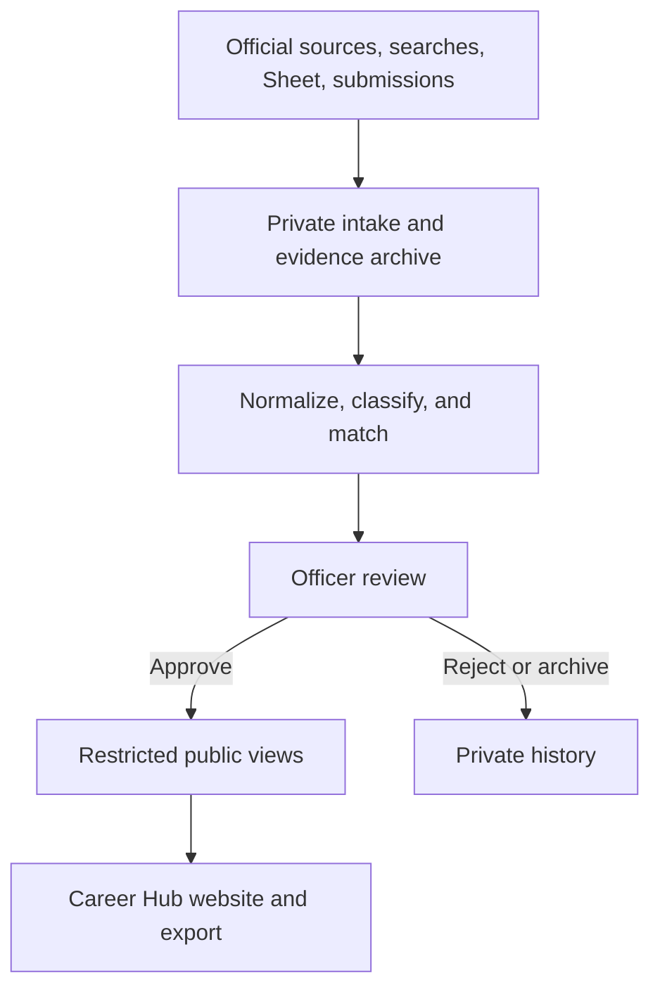

# Current architecture

**Verified code baseline:** `35c2b3e` on September 18, 2026  
**Scope:** durable system structure, not live record counts

The Career Hub is a Next.js application on Vercel backed by Supabase. Public
pages read restricted views. Private intake and automation create evidence and
review work. Only an authenticated active officer can approve publication.

## System map

No retrieval, model, spreadsheet, or submission path can skip officer review.

## Application surfaces

### Public

| Route | Purpose |
| --- | --- |
| `/` | Editorial homepage and entry points |
| `/internships` | Searchable opportunity board |
| `/calendar` | Stated deadlines, historical timing, and calendar export |
| `/eligibility` | Application and eligibility guidance |
| `/companies` | Employers represented by public records |
| `/about` | How the club maintains the resource |
| `/submit` | Narrow public suggestion intake |
| `/privacy` | Data and analytics disclosure |
| `/image-credits` | Scientific image attribution |

### Officer-only

| Route | Purpose |
| --- | --- |
| `/admin` | Operational summary |
| `/admin/login` | Allowlisted officer sign-in |
| `/admin/review` | Opportunity, submission, discovery, and task review |
| `/admin/import` | Google Sheet and CSV intake |
| `/admin/manage` | Correct, unpublish, archive, and restore reviewed records |
| `/admin/sources` | Governed source registration and execution |
| `/admin/integrations` | Run history and operational health |
| `/admin/add` | Manual private draft creation |
| `/admin/duplicates` | Duplicate review |

Officer access is allowlisted in Supabase. Email-link sign-in is primary;
password sign-in and recovery are retained as controlled alternatives.

## Data ownership

| Concern | Canonical owner |
| --- | --- |
| Product records and officer state | Supabase base tables |
| Public website data | Restricted `public_*` views |
| Database history | `supabase/migrations` |
| Raw imports and source evidence | Private Supabase records and storage |
| Google Sheet review mirror | Fixed `Review Queue` and `Archive` ranges |
| Classification vocabulary | `src/lib/pipeline/taxonomy/lanes.yaml` |
| Runtime orchestration | `src/lib/pipeline-cycle.ts` |
| Source connectors | `src/lib/ingestion` and `src/lib/pipeline/connectors` |
| Deployment schedules | `vercel.json` and `.github/workflows` |

The Sheet is a controlled review surface, not the publication database.
Generated Graphify output is a local development aid, not system authority.

## Intake and publication paths

### Spreadsheet and CSV

The importer archives raw rows, normalizes fields, scores and matches records,
then creates private drafts or review tasks. Re-importing an approved record may
refresh observation metadata but cannot silently replace reviewed public fields.

### Governed sources

Enabled `job_sources` create fetch runs, private payload records, normalized
postings, immutable posting versions, and officer work. Source testing is private
and does not grant publication authority.

### Web discovery

Search results are stored as private leads only when the provider configuration
and result-storage rights are explicitly enabled. LinkedIn is an indexed lead
surface, not a directly crawled authenticated source.

### Model extraction

Model extraction is optional and private. Assertions must bind to stored source
text. Model output cannot approve or update a public record.

### Public submissions

The public submission boundary accepts a narrow validated record into private
storage. It cannot modify opportunities or mark anything public.

### Officer decision

The audited review procedure changes review state, resolves related work, and
records the officer decision. Restricted public views independently enforce the
public-safe, audience, eligibility, status, and employer gates.

## Runtime and scheduling

- Vercel deploys `main`; preview deployments are disabled by project config.
- `/api/cron/ingest` runs daily at 14:00 UTC.
- `/api/cron/health` runs Mondays at 16:00 UTC.
- GitHub runs a daily recovery cycle at 14:15 UTC.
- The officer review digest runs Mondays at 16:00 UTC.
- CI, database-contract, Graphify, and security workflows protect pull requests.

Vercel and GitHub scheduling are recovery layers around the same bounded,
idempotent pipeline. Neither can publish.

## Security invariants

1. Public pages do not query private base tables.
2. Officer actions require an authenticated active officer before creating a
   privileged client.
3. Preview deployments cannot use privileged production credentials.
4. User-controlled search and filters are sanitized before database queries.
5. Imported notes remain private unless an officer deliberately authors public
   text.
6. Credentials, submitter details, raw evidence, and private notes are excluded
   from repository and public analytics.
7. Database and application rollout are verified separately.

## Where to go deeper

- Pipeline contract: [`pipeline-integration.md`](pipeline-integration.md)
- Database concepts: [`04-database-schema.md`](04-database-schema.md)
- Operational detail: [`operations-reference.md`](operations-reference.md)
- Current capability status: [`16-current-system-status.md`](16-current-system-status.md)
- Security: [`../SECURITY.md`](../SECURITY.md)
