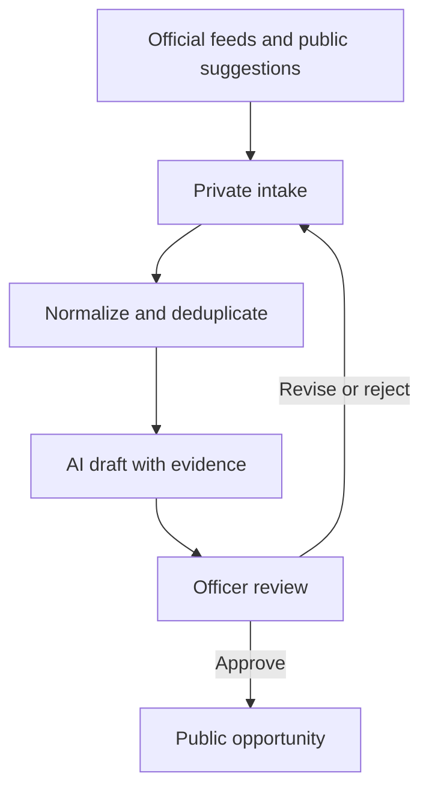

# Operations and search plan

Status: code audit and proposed design, September 9, 2026

This document describes what the Graduate Internship Hub does today, where the current workflow stops, and how to build a reliable search and officer-review system without letting automation publish unverified claims.

## Scope

The public product is for graduate internships. The first target audience is CSULB master's students, with eligibility shown in practical terms such as first-year MSc, second-year MSc, any master's year, doctoral only, mixed graduate, or unclear.

Undergraduate opportunities may be supported later with a separate model. They should not shape the current ranking, copy, or public filters.

This is a repository-level audit. It verifies migrations, application code, scripts, and GitHub workflows. It does not inspect private production rows in Supabase. Migration `0007_opportunity_audience.sql` was separately confirmed in the production SQL editor.

## What works now

| Area | Current behavior | Assessment |
| --- | --- | --- |
| Public board | Reads the restricted `public_opportunities` view and shows only approved, public-safe graduate or mixed records | Safe |
| Public submissions | `/submit` validates the URL, applies field limits and a honeypot, then inserts into `user_submissions` | Safe intake |
| Officer quick add | `/admin/add` creates an opportunity in `needs_review` | Working |
| CSV import | Stores raw rows, normalizes, deduplicates, scores, and queues new records for review | Working manual path |
| Officer review | Officers edit, approve, reject, or hide `opportunities` in `needs_review` | Working for opportunity records |
| GitHub publication | Reviewed JSON merged to `main` is validated and written to Supabase | Working, but overlaps the database workflow |
| Weekly email | Monday GitHub Action emails the `needs_review` opportunity queue | Working for one queue only |
| Source ingestion | Greenhouse fetcher, normalization, hashing, persistence, history, and review bridge have tests | Foundation only |
| Scheduled discovery | No production worker or schedule calls the source ingestion code | Not active |

The public safety boundary is sound: an opportunity is visible only after it is approved and marked public-safe. Anonymous visitors can submit records but cannot read private submissions.

## The gaps

| Priority | Gap | Why it matters | Fix |
| --- | --- | --- | --- |
| P0 | New `user_submissions` are counted on `/admin`, but there is no submissions inbox | A valid suggestion can sit unseen | Build `/admin/submissions` with open, claim, reject, spam, and convert-to-draft actions |
| P0 | Weekly email only queries `opportunities.status = needs_review` | Officers are not reminded about public suggestions | Add new and in-review submissions to the digest |
| P0 | Relevance scoring is undergraduate-oriented | The model rewards undergraduate wording and penalizes master's requirements | Replace it before automated discovery is enabled |
| P0 | There is no production ingestion runner | The tested Greenhouse connector never runs outside tests | Add a scheduled worker and source registry operations |
| P1 | `FOCUS_AREAS` mixes scientific domains and job functions | The filter says scientific lane but contains QA, sales, legal, and finance | Split scientific lane, job function, methods, and eligibility |
| P1 | GitHub JSON and Supabase review are two publication paths | Officers can be unsure where to edit a record | Make Supabase the record source of truth; keep GitHub for code, configuration, prompts, and evaluations |
| P1 | `audience_bucket` reflects the older broad product | It does not answer whether a first- or second-year MSc can apply | Add graduate-stage and evidence fields; retain the old field only during migration |
| P1 | About copy says automation surfaces roles | Discovery automation is not active | Describe the actual officer-reviewed process until the worker is live |
| P2 | No quality evaluation set exists for search or extraction | A score can look plausible while missing whole lanes | Maintain labeled true-positive, false-positive, and ambiguous examples by lane |
| P2 | No source-health alert covers failed or stale feeds | Silent connector failure can look like a quiet hiring week | Report last success, item count changes, errors, and stale sources |
| P2 | `HANDOFF.md` conflicts with newer ingestion plans | One document forbids automatic external retrieval while newer docs design it | Replace the blanket ban with an allowlisted, terms-reviewed source policy |

## Current paths

### Public suggestion

1. A visitor submits a link and optional details at `/submit`.
2. The browser writes an insert-only row to `user_submissions`.
3. The admin home count increases.
4. The workflow stops. The review page does not read this table, and the digest does not include it.

### Officer entry

1. An officer pastes or enters a role at `/admin/add`.
2. Company matching and duplicate checks run.
3. The opportunity is created as `needs_review`, pending, and not public-safe.
4. An officer reviews the official source, edits public wording, and approves or rejects it.
5. Approval sets the record to an allowed public state and marks it public-safe.

### CSV import

1. An officer exports a Sheet as CSV and uploads it at `/admin/import`.
2. The system records an import run and preserves raw rows.
3. Rows are normalized, deduplicated, and scored.
4. New records enter `needs_review`.
5. A change to an already approved record creates a review task rather than silently replacing officer-reviewed fields.

### Reviewed JSON

1. An officer edits `data/reviewed-opportunities.json` in GitHub.
2. A merge to `main` triggers `publish-reviewed-data.yml`.
3. The script validates each record and writes it to Supabase.

This path is useful as a controlled batch loader, but it should not remain a second everyday editing system after the admin workflow is complete.

### Weekly email

1. `weekly-review-digest.yml` runs manually or Mondays at 16:00 UTC.
2. It reads `opportunities` with `status = needs_review`.
3. It sends a Gmail message only when records are waiting.

The club mailbox is intentionally excluded during development. The workflow currently sends only to the configured personal recipient.

### Source ingestion foundation

The database and code can represent:

- approved job sources;
- queued and claimed fetch runs;
- private raw payloads;
- normalized source postings;
- material-change history;
- source-to-opportunity links;
- review tasks created from new or changed postings.

The Greenhouse connector is defensive and extensively tested, but no command, worker, Edge Function, or GitHub workflow currently calls it in production.

## Target pipeline



The stages have different responsibilities:

1. **Retrieve.** Use approved official feeds where possible. A web-search agent may discover candidates on unsupported sites, but it stores only candidate URLs and source evidence.
2. **Preserve.** Save the original submission or source payload privately before transforming it.
3. **Normalize.** Canonicalize URLs, company names, titles, locations, dates, and source identifiers.
4. **Deduplicate.** Prefer ATS posting ID, then canonical URL, then strict company/title matching. Recurring annual programs should be linked as a family, not collapsed into one record.
5. **Draft.** AI extracts structured fields and cites the exact source text behind eligibility, dates, location, and work authorization. Unknown remains unknown.
6. **Review.** An officer opens the official posting and confirms the fields that affect a student's decision.
7. **Publish.** Only an officer action may set `review_status = approved` and `public_safe = true`.
8. **Recheck.** Revisit live status, deadlines, and material changes on a schedule. A changed approved record returns to review.
9. **Report.** Email officers about new submissions, new candidates, changed postings, deadlines, stale records, and source failures.

## Submission workflow

Build this before adding a spreadsheet:

1. Add `/admin/submissions`.
2. Show the original URL, submitter note, and private contact fields.
3. Let an officer claim a row and mark obvious spam or duplicates.
4. Fetch the official page through an approved retrieval method.
5. Generate a structured draft. Keep the original input beside it.
6. Let the officer edit and convert the submission into an `opportunities` record in `needs_review`.
7. Record `created_opportunity_id`, reviewer, timestamp, and decision notes.
8. Include outstanding submissions in the Monday digest.

For a small officer team, conversion and publication may happen in one screen, but they should remain two explicit buttons: **Save draft** and **Approve for the board**.

### What AI may do

- extract the employer and role title;
- find the canonical official URL;
- identify scientific lanes and job functions;
- extract methods and skills;
- classify first-year MSc, second-year MSc, any master's year, doctoral only, mixed graduate, not eligible, or unclear;
- extract graduation window, continued-enrollment requirement, work authorization, location, compensation, application open date, and deadline;
- highlight contradictory language;
- propose concise public notes;
- assign confidence per field and quote the supporting source passage.

### What AI may not do

- approve a record;
- infer a current opening from a past recruiting cycle;
- turn a historical month into a stated deadline;
- hide contradictory eligibility language;
- publish submitter contact information;
- mark a role MSc-eligible without source evidence;
- treat a high relevance score as verification.

## Spreadsheet role

A Google Sheet can be useful, but it should be a view or intake aid, not the record source of truth.

Recommended tabs:

| Tab | Purpose | Write direction |
| --- | --- | --- |
| New suggestions | Sanitized queue for officer triage | Supabase to Sheet |
| Review work | Candidate fields, status, assignee, and source URL | Prefer Supabase to Sheet; limited officer status edits may sync back |
| Published | Read-only export of current public records | Supabase to Sheet |
| Archive | Semester snapshot | Supabase to Sheet |

Do not put submitter names, email addresses, raw payloads, private notes, secrets, or OAuth tokens in GitHub or a broadly shared Sheet.

If officers need to edit in Sheets, use row IDs and one-way field ownership. For example, the Sheet may own `officer_status` and `officer_note`, while Supabase owns source evidence, public fields, timestamps, and publication state. The Google Sheets API supports reading, updating, and appending ranges, so a controlled mirror is straightforward. See the [Google Sheets values guide](https://developers.google.com/workspace/sheets/api/guides/values).

## Data model changes

Keep the current opportunity table stable while adding structured review fields.

| Field | Type | Purpose |
| --- | --- | --- |
| `scientific_lanes` | text array | Research domains such as genomics or immunology |
| `job_functions` | text array | Work type such as R&D, bioinformatics, QC, or regulatory |
| `methods` | text array | PCR, cell culture, RNA-seq, flow cytometry, Python, and similar |
| `graduate_stage` | enum | `msc_year_1`, `msc_year_2`, `msc_any`, `doctoral_only`, `mixed_graduate`, `not_msc`, `unknown` |
| `eligibility_status` | enum | `confirmed`, `possible`, `not_eligible`, `unknown` for the selected audience |
| `eligibility_evidence` | text | Source-backed explanation, not marketing copy |
| `continued_enrollment_required` | boolean or null | Whether the student must return to school |
| `graduation_window_start` | date or null | Earliest eligible graduation date |
| `graduation_window_end` | date or null | Latest eligible graduation date |
| `work_authorization` | enum or text | Published employer requirement, with unknown allowed |
| `application_opened_at` | date or null | Source-stated opening date |
| `application_deadline_at` | timestamptz or null | Source-stated closing time |
| `date_basis` | enum | `stated`, `historical_pattern`, `unknown` |
| `last_source_check_at` | timestamptz | Most recent live-source verification |
| `source_check_result` | enum | `open`, `closed`, `changed`, `missing`, `error` |

Store AI provenance on the candidate or review task, not as unquestioned facts on the public record:

- model and version;
- prompt version;
- extraction schema version;
- generated timestamp;
- source URL and retrieved timestamp;
- field-level confidence;
- cited source excerpts;
- full structured output;
- officer corrections.

Officer corrections should feed the evaluation set. They should not automatically retrain or rewrite prompts.

## Search taxonomy

Search and display need separate axes. A molecular-oncology internship may have the scientific lanes `cancer biology` and `molecular biology`, the job function `R&D`, and the methods `cell culture`, `CRISPR`, and `flow cytometry`.

### Scientific lanes

| Lane | Include terms | Common adjacent terms |
| --- | --- | --- |
| Genomics and genetics | genomics, genetics, human genetics, functional genomics, population genomics, pharmacogenomics, genomic medicine, variant interpretation | genome biology, genetic disease, inherited disease |
| Cancer biology and oncology | cancer biology, oncology, tumor biology, tumor microenvironment, cancer genomics, precision oncology, immuno-oncology | solid tumor, hematologic malignancy, biomarker oncology |
| Bioinformatics and computational biology | bioinformatics, computational biology, biomedical data science, biostatistics, systems biology, multiomics, sequence analysis | health data science, scientific computing, computational genomics |
| Molecular and cell biology | molecular biology, cell biology, cell signaling, gene expression, epigenetics, protein biology | cellular biology, mechanistic biology, genome engineering |
| Immunology | immunology, immune biology, immunotherapy, vaccine research, inflammation, autoimmunity | immune profiling, translational immunology, immunoassay |
| Microbiology and infectious disease | microbiology, bacteriology, virology, infectious disease, antimicrobial resistance, host-pathogen | pathogen genomics, viral vectors, microbial genomics |
| Diagnostics and precision medicine | diagnostics, molecular diagnostics, companion diagnostics, clinical laboratory, precision medicine, biomarker development | diagnostic assay, liquid biopsy, clinical genomics |
| Drug discovery and pharmacology | drug discovery, pharmacology, medicinal chemistry, screening, target validation, preclinical, toxicology | discovery biology, DMPK, ADME, translational pharmacology |
| Bioprocessing and biomanufacturing | bioprocess, biomanufacturing, upstream process, downstream process, fermentation, purification, scale-up | process sciences, MSAT, tech transfer, GMP manufacturing |
| Cell and gene therapy | cell therapy, gene therapy, CAR-T, viral vector, gene editing, stem cell, regenerative medicine | advanced therapies, vector development, CMC |
| Clinical and translational research | clinical research, translational research, clinical development, clinical operations, trial operations | clinical science, translational medicine, real-world evidence |
| Public health and epidemiology | epidemiology, public health, population health, surveillance, health outcomes | genomic epidemiology, infectious disease surveillance |
| Neuroscience | neuroscience, neurobiology, neurogenetics, neuro-oncology, CNS | neural engineering, neurodegeneration |
| Agricultural and environmental biotech | agricultural biotechnology, plant biology, food science, environmental biotechnology, synthetic biology | crop science, industrial biotechnology, sustainability |

The last three lanes may be enabled or disabled by club policy without changing the retrieval engine.

### Job functions

| Function | Include terms |
| --- | --- |
| Research and discovery | research intern, discovery intern, biology intern, scientist intern, research associate intern |
| Computational and data | bioinformatics intern, computational biology intern, data science intern, biostatistics intern, ML intern |
| Assay and analytical development | assay development, analytical development, method development, validation, characterization |
| Process development and MSAT | process development, upstream, downstream, process engineering, MSAT, technology transfer |
| Manufacturing and operations | manufacturing intern, operations intern, production, GMP, supply chain life sciences |
| Quality control | QC intern, quality control, microbiology QC, analytical QC, laboratory quality |
| Quality assurance | QA intern, quality assurance, quality systems, validation, compliance, CAPA |
| Regulatory affairs | regulatory affairs intern, regulatory science, submissions, labeling, CMC regulatory |
| Clinical research | clinical research intern, clinical operations, trial management, clinical data management |
| Medical and scientific affairs | medical affairs intern, scientific communications, medical writing, publications |
| Laboratory automation and informatics | laboratory automation, LIMS, scientific software, bioautomation, robotics |
| Program and project work | program management intern, project management intern, portfolio operations |
| Product and commercial biotech | product intern, market access, business development, commercial strategy, marketing in life sciences |

Commercial, finance, legal, and general software roles should require an explicit life-science context. They are adjacent, not default scientific matches.

### Opportunity terms

Primary terms:

- graduate intern, graduate internship;
- master's intern, master's internship, MSc intern, MS intern;
- summer intern, summer internship;
- student intern, student internship;
- co-op, cooperative education;
- graduate student researcher, student trainee;
- summer associate when the description confirms current-student eligibility.

Secondary terms to review carefully:

- fellowship, traineeship, practicum, placement, externship, residency;
- early careers, university recruiting, student programs;
- seasonal research assistant.

Do not include a regular full-time role merely because it says entry level or accepts a master's degree.

### Graduate eligibility terms

Strong positive evidence:

- current graduate student;
- currently enrolled in a master's or graduate program;
- pursuing an MS, MSc, MPH, MEng, MBA, or related graduate degree;
- first-year master's student, second-year master's student;
- completed the first year of a master's program;
- returning to the degree program after the internship;
- expected graduation within a stated master's window;
- master's or PhD student, graduate students at any level.

Strong exclusion evidence for the MSc audience:

- undergraduate students only;
- bachelor's students only;
- rising junior or senior only;
- doctoral or PhD students only;
- postdoctoral fellows only;
- MD students only;
- degree already required before the internship when current students are not accepted.

Ambiguous, not negative by itself:

- bachelor's or master's degree;
- graduate degree preferred;
- recent graduate;
- entry level;
- junior or senior in a job title;
- graduate without a sentence showing whether it means a student or a completed degree.

### Methods and skills

Methods improve ranking within a lane but should not determine eligibility:

- wet lab: PCR, qPCR, ddPCR, cloning, CRISPR, Western blot, ELISA, flow cytometry, microscopy, cell culture, organoids, sequencing library preparation;
- genomics: RNA-seq, single-cell RNA-seq, ATAC-seq, ChIP-seq, whole-genome sequencing, exome sequencing, spatial omics, variant calling;
- computational: Python, R, SQL, Linux, Bash, Bioconductor, Nextflow, Snakemake, cloud computing, machine learning, statistics;
- protein and analytical: mass spectrometry, HPLC, chromatography, spectroscopy, protein purification, biophysical characterization;
- bioprocess: fermentation, bioreactor, upstream, downstream, purification, scale-up, GMP, DOE;
- clinical and quality: GCP, clinical trials, EDC, SAS, quality systems, CAPA, validation, regulatory submissions.

## Query logic

Use high-recall retrieval first, then high-precision review. One giant Boolean query will miss postings because job sites use inconsistent vocabulary.

### Employer feed search

For each approved employer or program source:

1. Retrieve all currently published postings from the official feed.
2. Keep records matching at least one opportunity term or a known student-program source.
3. Require at least one life-science domain, job-function, or method match.
4. Parse the full description for graduate eligibility.
5. Exclude only explicit non-MSc restrictions. Send ambiguity to review.

Official feeds should be preferred because they enumerate current postings. Greenhouse GET endpoints are public and do not require authentication, Ashby exposes currently published postings for a job board, Lever exposes published postings, and USAJOBS exposes currently open announcements through its search API. See [Greenhouse](https://docs.greenhouse.io/job-board.html), [Ashby](https://developers.ashbyhq.com/docs/public-job-posting-api), [Lever](https://github.com/lever/postings-api), and [USAJOBS](https://developer.usajobs.gov/api-reference/get-api-search).

### Broad web discovery

Run small query families by lane and season. Examples:

```text
("graduate intern" OR "master's intern" OR "MSc intern")
(genomics OR bioinformatics OR "computational biology")
(2027 OR summer)

("graduate internship" OR "student intern")
(oncology OR "cancer biology" OR "immuno-oncology")
(California OR remote)

("MS student" OR "master's student" OR "graduate student")
("process development" OR biomanufacturing OR bioprocess)
(intern OR co-op)

site:boards.greenhouse.io OR site:job-boards.greenhouse.io
("graduate intern" OR "master's student")
(biotechnology OR genomics OR diagnostics)

site:jobs.lever.co
(intern OR co-op)
(bioinformatics OR molecular OR clinical OR regulatory)
(master's OR graduate)

site:jobs.ashbyhq.com
(intern OR internship)
(genomics OR oncology OR diagnostics OR bioprocess)
```

Also search the web pages of known employers that use unsupported or customized systems. A discovery result is a lead, not proof that the role is open.

### Deterministic filters

Apply these before AI scoring:

- reject invalid or non-HTTPS canonical URLs unless the source is an approved exception;
- reject application aggregators when an official employer source is available;
- reject clear regular full-time jobs with no student-program evidence;
- route explicit undergraduate-only, doctoral-only, or completed-degree-only requirements away from the MSc board;
- keep contradictory and missing eligibility language as `unknown`;
- keep source-stated dates separate from historical timing;
- never convert a search-engine date or snippet into a posting deadline;
- treat location, work authorization, compensation, and sponsorship as independent fields.

### Ranking

Rank the officer queue, not the public truth.

Suggested 100-point review-priority score:

| Component | Range | Notes |
| --- | ---: | --- |
| Graduate eligibility evidence | 0 to 30 | Highest weight; explicit MSc language scores best |
| Internship evidence | 0 to 15 | Current-student internship or co-op language |
| Scientific lane match | 0 to 15 | One or more enabled club lanes |
| Job-function match | 0 to 10 | Role work matches a supported function |
| Source quality | 0 to 10 | Official feed or employer page |
| Date freshness | 0 to 10 | Current source-stated posting/open dates |
| Geography | 0 to 5 | SoCal, California, remote US, or relocation support |
| Field completeness | 0 to 5 | Enough evidence for an efficient review |

Hard restrictions are classifications, not large negative scores. A doctoral-only role is not a low-scoring MSc role; it is ineligible for the selected audience.

## Recurring searches

### Recommended runtime

Use Supabase Cron to create scheduled jobs and invoke a Supabase Edge Function or database function. Supabase Cron records runs in Postgres and can make HTTP requests to Edge Functions. See [Supabase Cron](https://supabase.com/docs/guides/cron).

GitHub Actions should continue to run CI, controlled publication utilities, and the weekly email. It is acceptable for a low-stakes digest, but GitHub documents that scheduled workflows may be delayed or even dropped during high load. It should not be the only scheduler for source monitoring. See [GitHub scheduled workflow behavior](https://docs.github.com/actions/using-workflows/events-that-trigger-workflows#schedule).

For unsupported sources, an agentic web-search worker can use the OpenAI Responses API with web search, domain filters, full source lists, and visible citations. Structured Outputs should constrain the extraction to the same versioned schema used by the application. See [OpenAI web search](https://developers.openai.com/api/docs/guides/tools-web-search) and [Structured Outputs](https://developers.openai.com/api/docs/guides/structured-outputs).

### Proposed cadence

| Task | Aug to Nov | Dec to Feb | Mar to Jul |
| --- | --- | --- | --- |
| Official ATS feeds | Daily | Every 1 to 2 days | Two to three times weekly |
| Known program pages | Two to three times weekly | Twice weekly | Weekly |
| Broad lane web searches | Three times weekly | Twice weekly | Weekly |
| Deadlines within 14 days | Daily | Daily | Daily |
| Other approved records | Weekly | Weekly | Weekly |
| Officer digest | Monday | Monday | Monday |
| Source health report | Monday | Monday | Monday |
| Query and taxonomy review | Monthly | Monthly | Monthly |
| Labeled evaluation run | Before each prompt, rule, or model release | Same | Same |

Schedule jobs away from the start of the hour. Use idempotency keys so a delayed or duplicated run cannot create duplicate records.

### Agent tasks

Create separate bounded agents rather than one general job hunter:

1. **Feed monitor:** retrieves all postings from one approved ATS source and records additions, removals, and material changes.
2. **Program-page monitor:** checks a known internship page for a stated current cycle, opening date, deadline, and application link.
3. **Lane scout:** searches one scientific lane using a versioned query set and approved domains.
4. **Eligibility extractor:** reads one official posting and returns structured graduate-stage evidence.
5. **Date checker:** distinguishes stated current dates, historical patterns, and unknown timing.
6. **Source-health monitor:** detects failures, unexpected zero results, stale runs, redirects, and schema changes.
7. **Digest writer:** summarizes database facts for officers without changing records.

Every agent output should include `run_id`, query or source ID, retrieved timestamp, canonical URL, evidence, schema version, and outcome. Agents write to private intake or review tables only.

### Failure controls

- allowlist domains and source types;
- review terms, robots guidance, and request rate before enabling a source;
- impose timeouts, response-size limits, redirect checks, and bounded retries;
- store raw payloads privately with retention limits;
- use per-source locks and idempotency keys;
- alert on repeated failures and unexpected zero-result feeds;
- quarantine malformed or contradictory records;
- keep prompt and taxonomy versions in GitHub;
- require officer approval for public changes;
- log who approved what and which source they checked;
- never email the club distribution address until recipients and content are deliberately enabled.

## Quality measurement

Create a small labeled set before turning on recurring search:

- 20 confirmed MSc-eligible roles across several lanes;
- 10 undergraduate-only roles;
- 10 PhD-only or postdoctoral roles;
- 10 ambiguous graduate/completed-degree cases;
- 10 regular jobs that contain scientific keywords but are not internships;
- 10 historical or closed program pages;
- examples with contradictory graduation, enrollment, location, and authorization language.

Measure:

- discovery recall by lane;
- officer-queue precision;
- eligibility classification accuracy;
- date-basis accuracy;
- duplicate rate;
- median officer review time;
- proportion of AI fields officers correct;
- source success and staleness rates.

Do not optimize one combined score. A search can have good precision while missing an entire lane, and an extraction can be well formatted while getting eligibility wrong.

## Build order

### Phase 1: close the operating gap

1. Build the submissions inbox and conversion flow.
2. Add submissions, changed postings, and stale items to the digest.
3. Replace undergraduate scoring and tests with graduate-stage classification.
4. Correct About and internal documentation so they match production behavior.

### Phase 2: fix the information model

1. Add scientific lanes, job functions, methods, graduate stage, and evidence fields.
2. Migrate current graduate and mixed records.
3. Update filters and admin review UI.
4. Create and run the labeled evaluation set.

### Phase 3: activate approved sources

1. Add a production worker around the existing Greenhouse connector.
2. Enable Supabase Cron and source-health reporting.
3. Add a small curated employer source registry.
4. Add Ashby, Lever, and USAJOBS connectors only after per-source tests and policy review.

### Phase 4: add AI drafting and discovery

1. Add structured extraction with evidence and prompt versioning.
2. Show original source and AI draft side by side.
3. Add one lane scout at a time and evaluate it.
4. Add the optional sanitized Sheet mirror after the admin queue is dependable.

### Phase 5: operate and improve

1. Review false positives, misses, and officer corrections monthly.
2. Retire weak queries and add missing synonyms.
3. Expand scientific lanes and employers based on measured gaps.
4. Archive semester data and report source coverage.

## Immediate recommendation

The next implementation should be the officer submissions inbox plus digest coverage. It fixes a real reliability hole with little model risk. After that, replace the undergraduate scoring model and data labels. Only then should recurring discovery be enabled.

The right spreadsheet integration is a sanitized officer mirror, not a second source of truth. The right AI integration is evidence-backed drafting, not automated approval.
